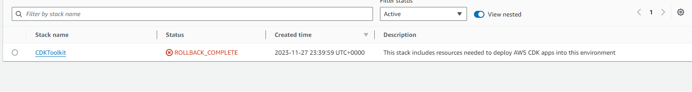

# Serverless REST web API.

Name: Cormac Farrell

This repository contains the implementation of a serverless REST API for the AWS platform. A CDK stack creates the infrastructure. The domain context of the API is movie reviews.

API endpoints.
POST /movies/reviews - add a movie review.
GET /movies/{movieId}/reviews - Get all the reviews for a movie with the specified id.!
GET /movies/{movieId}/reviews? - Get all the reviews for the movie with the specified ID 
GET /movies/{movieId}/reviews/{reviewerName} - Get the review for the movie with the specified movie ID and written by the named reviewer.
GET /movies/{movieId}/reviews/{Name} - Get the review for the movie with the specified movie Name.

Encountered Boostrapping error that persisted and prevented testing, cognito labs were configured and dont display any errors but no way to test running application so I added what was possible from the Labs and mimiced the process for creating the reviews requests though I can't Confirm if they work

Enter Following Commandsto Run:

npm install
npm run schema
cdk deploy
cdk destroy

Screenshots:
[Alt text](image.png)

